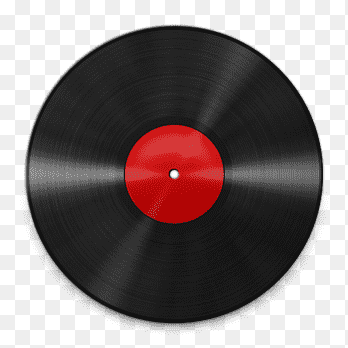

# 🎧 Rádio M3U – Web Player de Rádios Online

Uma aplicação web leve e responsiva para ouvir **rádios online via links M3U/streaming** diretamente do navegador, sem necessidade de plugins ou softwares adicionais.



## 🌐 Acesse

> Compatível com **Google Chrome**, **Firefox**, **Edge** e navegadores móveis.  
> Também pode ser instalada como **PWA (Progressive Web App)** em smartphones.

---

## ✅ Funcionalidades

- 🎵 Reprodutor de streaming de rádios via URL (AAC, MP3, M3U, etc.)
- 🔁 Reconexão automática em caso de erro de conexão
- ⏯ Botão de **Play/Pause**
- 📱 Suporte a **Media Session API** (controlos nativos em dispositivos móveis)
- 📶 Indicador de **status da transmissão** e **buffer**
- 🌓 Interface escura e responsiva
- 🖥️ Pode ser instalada como **App de desktop ou mobile (PWA)**
- 📋 Lista personalizável de rádios

---

## 📻 Rádios incluídas (exemplos)

- Geração Rock  
- Alpha FM  
- Rádio 89 FM Rock  
- Metal Zone Radio  
- Trap Radio  
- Rádio BOB - Metal  
- Dumont FM - 104.3  

Você pode editar o código para adicionar, remover ou modificar os streams da `<select>` com facilidade.

---

## 🚀 Como usar

1. Clone ou baixe o projeto:
   ```bash
   git clone https://github.com/seu-usuario/radio-m3u.git
